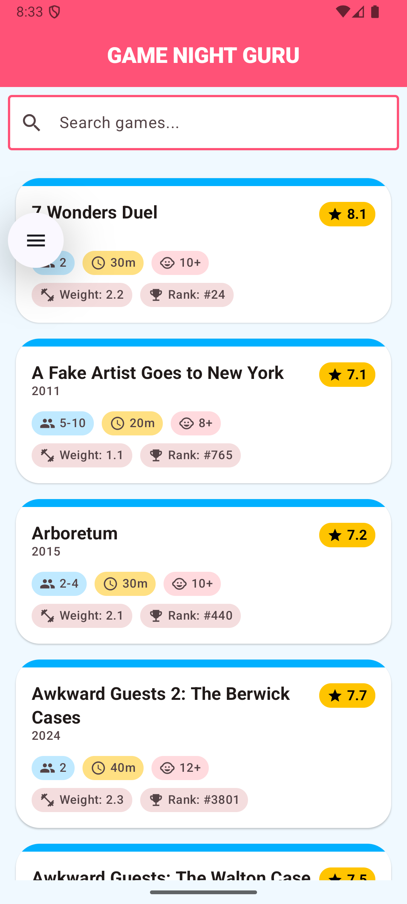
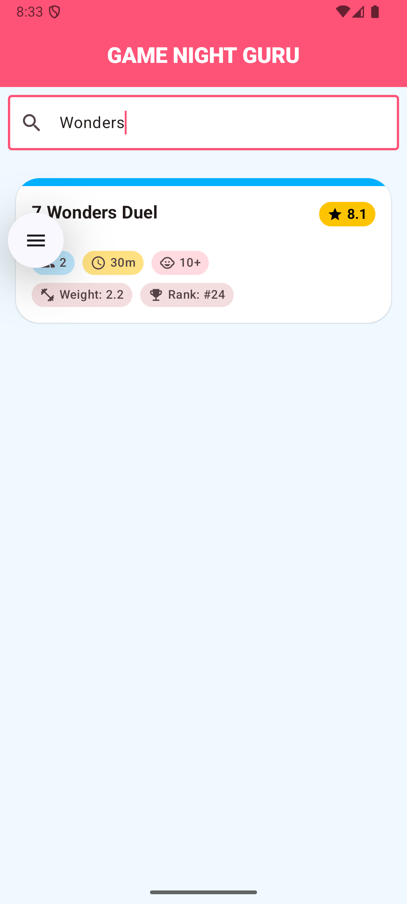

# Game Night Guru

This is a simple demo app for the Game Night Guru workshop.

## Screenshots

| Game List | Search |
| --- | --- |
|  |  |

## Architecture

- **Jetpack Compose**: Modern UI toolkit.
- **Room Database**: Local data storage.
- **Hilt**: Dependency injection.
- **Repository Pattern**: Clean separation of concerns.

## How to add or replace games

The app loads games from a CSV file bundled in the assets.

1.  **Replace existing games**: Replace the file at `app/src/main/assets/collection.csv` with your own CSV file.
    - Ensure the column headers match the existing ones.
    - Specifically, `objectid` (Primary Key), `objectname`, `numplays`, and `rating` are used by the app.
2.  **Add more games**: You can add more rows to `collection.csv`.
    - Duplicates (based on `objectid`) will be replaced in the database.
3.  **Reset data**: Since the app only imports the CSV if the database is empty, you may need to clear the app data or uninstall/reinstall the app to see changes from a new CSV.

## Project Structure

- `data/database`: Room entity, DAO, and Database definition.
- `data/repository`: Data source abstraction.
- `data/importer`: Logic for parsing the CSV file.
- `ui/list`: Screen and ViewModel for displaying the game list.
- `ui/components`: Reusable UI components.
- `di`: Hilt modules for dependency injection.

## Data Attribution

The game collection data used in this app is sourced from [BoardGameGeek](https://boardgamegeek.com).

- **Data Source**: The sample `collection.csv` is based on the collection of user [katie5](https://boardgamegeek.com/collection/user/katie5) on BoardGameGeek.
- **API**: Data was retrieved using the [BoardGameGeek XML API2](https://boardgamegeek.com/wiki/page/BGG_XML_API2).
- **Disclaimer**: This app is not affiliated with, maintained, authorized, or sponsored by BoardGameGeek. All product and company names are the registered trademarks of their original owners. The use of any trade name or trademark is for identification and reference purposes only and does not imply any association with the trademark holder of their product brand.
