# AI, Meet App: Teaching Android Apps to Talk to Gemini via App Functions

## Download and Install Android Studio
Duration: 0

If you haven't yet, download and install Android Studio. It is best to have the latest stable version from the [Android Studio download page](https://developer.android.com/studio/?gclid=Cj0KCQiAjJOQBhCkARIsAEKMtO3zEhdK4_I0CEZic3UH4dl-9gVXuHFR9dCl3TOHKjmv3xWLU3UxfhYaApfAEALw_wcB&gclsrc=aw.ds&authuser=894489108).

For more detailed instructions, follow the [Download and install Android Studio codelab](https://developer.android.com/codelabs/basic-android-kotlin-compose-install-android-studio#0).

## Create an Android Emulator
Duration: 1

> **Note:** If you decide to use a physical device and connect it to your computer with a cable you can skip this step!

It can take a while for the emulator image to download, so while you are waiting, create a new emulator. 

> **Note:** For this codelab, you will need to use a System Image of **36.0** and above. 
> Usually I use a **Medium Phone** but any other one you have should be fine. 

For more detailed instructions, follow the [Run your first app on the Android Emulator codelab - Step 3](https://developer.android.com/codelabs/basic-android-kotlin-compose-emulator#2).


## Introducing Game Night Guru
Duration: 3

The demo app for this codelab is **Game Night Guru**, a boardgame collection manager and play tracker. It helps hobbyists keep track of the games they own and log their gaming sessions.  

[Download Source Code](https://github.com/KatieBarnett/GameNightGuru/archive/refs/heads/main.zip)

You can also clone it from github:
- Clone the the official App Functions repository using your terminal:
  ```bash
  git clone https://github.com/android/appfunctions.git
  ```
- Clone the official App Functions repository using your favourite source control application using:
  ```bash
  git@github.com:android/appfunctions.git
  ```

Here is what the app looks like:

| Game Night Guru | Game List | Game Detail (Play Log) | Add Play Dialog |
| --- | --- | --- | --- |
|  | 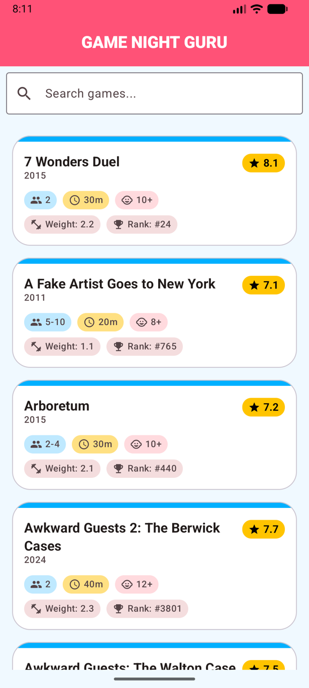 | 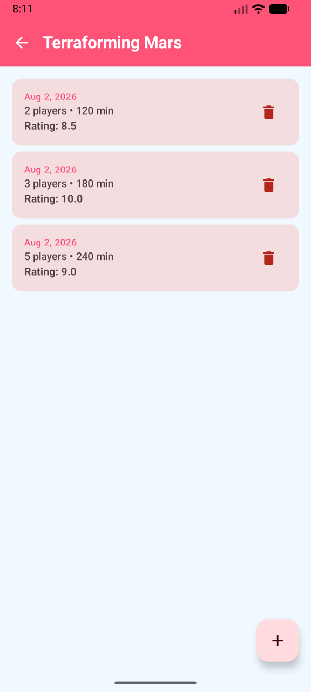 | 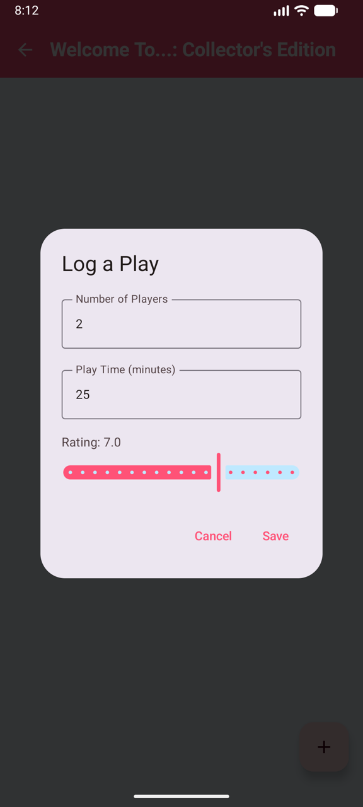|

_For demonstration purposes, a list of games has been added (exported from [Boardgame Geek](https://boardgamegeek.com/) ), if you want to replace them check out the [README](https://github.com/KatieBarnett/GameNightGuru/blob/main/README.md). 

### Core Features  
  
*   **Game Collection Management:** Browse a comprehensive list of board games in the library.  
*   **Detailed Insights:** View specific details for each game, including player counts, recommended ages, and average playtime.  
*   **Play Tracking:** Log gaming sessions, recording how many people played, how long it took, and how you'd rate the experience.  

### App Walkthrough  

**1. The Game List**

The main screen of the app displays the board game collection. Each entry provides a quick glance at the game's title and its player count range.  
*   Navigation: Tapping on any game in the list will take you to its details.  
  
**2. Game Details**

The detail screen provides a deeper dive into a specific game. Here you can see:  
*   Metadata: Playing time, player counts, and age recommendations.  
*   Play History: A history of your logged sessions for this specific game.  
*   Actions: A button to log a new play session.  
  
**3. Logging a Play**
  
From the Game Detail screen, you can open the **Add Play** dialog. This allows you to enter:  
*   The number of players for that specific session.  
*   The actual duration of the game.  
*   A rating (1-10) for the session.  
  
### Technical Stack  
  
The app is built using modern Android development practices:  
*   **Language:** Kotlin  
*   **UI Framework:** Jetpack Compose for a fully declarative UI.  
*   **Navigation:** Jetpack Navigation 3.  
*   **Database:** Room for local persistence of games and play records.  
*   **Dependency Injection:** Hilt for managing app components.  
  
### Project Structure  
  
- `data/database`: Room entity, DAO, and Database definition.  
- `data/repository`: Data source abstraction.  
- `data/importer`: Logic for parsing the CSV file.  
- `ui/list`: Screen and ViewModel for displaying the game list.  
- `ui/detail`: Screen and ViewModel for displaying the game detail (play log) & add play dialog.  
- `ui/components`: Reusable UI components.  
- `di`: Hilt modules for dependency injection.

## Preparing for App Functions 
Duration: 5

First thing to do, is add the dependencies to the `app` `build.gradle.kts` with the version `1.0.0-alpha10` or later. 


```kotlin
dependencies {
  implementation("androidx.appfunctions:appfunctions:1.0.0-alpha10")
  ksp("androidx.appfunctions:appfunctions-compiler:1.0.0-alpha10")
}
``` 

> **Note:** You can also add them to the version catalog `libs.versions.toml` like the other dependencies in this project if you want.

Sync your project by clicking **Sync now** in the Gradle change notification bar once you have added these dependencies.
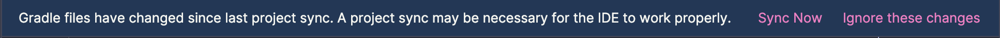

## Writing our first App Function
Duration: 10

We are going to add an App Function `queryGames` that will query our list of games in the database and return a game based on the information the user requests. 

We'll allow the user to specify some or all of these parameters to select a game:
- the the maximum time the game should take (`maxDurationMinutes`)
- the number of players available to play the game (`numPlayers`)
- the minimum age of the players (`minAge`)

And we want the function to return a list of games matching this criteria. 


To make it easier to use the `GameRepository` within the App Functions, I have added a shell that does the dependency injection for you in `GameAppFunctions.kt`.

Once your project is synced, open up the `GameAppFunctions.kt` file and uncomment all the code:

```kotlin
@RequiresApi(Build.VERSION_CODES.BAKLAVA)  
abstract class GameAppFunctions : AppFunctionService() {  
  
    private lateinit var gameRepository: GameRepository  
  
    override fun onCreate() {  
        super.onCreate()  
        val entryPoint = EntryPointAccessors.fromApplication(  
            applicationContext,  
            GameAppFunctionsEntryPoint::class.java  
        )  
        gameRepository = entryPoint.gameRepository()  
    }  
  
    @EntryPoint  
    @InstallIn(SingletonComponent::class)  
    interface GameAppFunctionsEntryPoint {  
        fun gameRepository(): GameRepository  
    }  
  
    // Add your App Functions here  
  
}  
  
// Add the GameSummary data class here
```

> **Note:** There are also imports at the top of the file, make sure to uncomment those as well, I have not included them above to make it easier to read 

Let's create the `queryGames` function.

### App Function Anatomy

We need five pieces to make our App Function work:

**1. [KDoc](https://kotlinlang.org/docs/kotlin-doc.html) comments to describe what the function does, including descriptions of the inputs and output**
```kotlin
/**
 * Query what game to play based on duration, number of players, and age.
 *
 * @param maxDurationMinutes The maximum duration in minutes for the game.
 * @param numPlayers The number of players.
 * @param minAge The minimum age of the players.
 * @return A list of games matching the criteria.
 */
```
   
**2. The `@AppFunction` annotation**
```kotlin
@AppFunction(isDescribedByKDoc = true)
```
   
By setting  `isDescribedByKDoc = true`, you're bridging the gap between human-readable comments and machine-readable metadata. It bundles the Kotlin documentation into the function's metadata, giving the AI agent the context it needs to successfully trigger the code. Without this the AI will need to guess at what the function does. 

**3. The inputs to the function:**

```kotlin
maxDurationMinutes: Int? = null,
numPlayers: Int? = null,
minAge: Int? = null
```

By setting all these as nullable we can allow the AI to provide one or more based on what the user asks from the AI.  

**4. The function code that actually performs the action**

We can get a list of games from our `GameRespository` using:

```kotlin
val allGames = gameRepository.getAllGames().first()
	allGames.filter { game ->
		val durationMatch = maxDurationMinutes == null || game.maxPlayTime <= maxDurationMinutes
		val playersMatch = numPlayers == null || (numPlayers >= game.minPlayers && numPlayers <= game.maxPlayers)
		val ageMatch = minAge == null || extractMinAge(game.bggRecAgeRange) <= minAge
		durationMatch && playersMatch && ageMatch
	}
```

With a helper function of:
```kotlin
private fun extractMinAge(ageRange: String): Int {  
    return ageRange.filter { it.isDigit() }.toIntOrNull() ?: 0  
}
```

Because this data fetching could take a while, we need to make sure that we declare the function as a `suspend` function. 

> **Note:** If you have a lot of processing to do, it can be a good idea to switch to suitable coroutine dispatcher so the UI thread is not blocked. We don't need to worry about it here as `getAllGames`in `GameRepository` already use the `IO` dispatcher as part of the database integration. 

**5. The output object**

So that the AI can receive and understand the output, we need to create a serialised class with all the information that the AI needs:

```kotlin
/**  
 * A summary of a game. 
 */
@AppFunctionSerializable(isDescribedByKDoc = true)  
data class GameSummary(  
    /** The unique identifier of the game */  
    val id: Long,  
    /** The name of the game */  
    val name: String,  
    /** The minimum number of players */  
    val minPlayers: Int,  
    /** The maximum number of players */  
    val maxPlayers: Int,  
    /** The average playing time in minutes */  
    val playingTime: Int  
)
```

Again, we can make sure the AI knows what all these parameters are using the annotation `@AppFunctionSerializable` with `isDescribedByKDoc = true`.

 ### Putting this all together into our `queryGames` function: 

```kotlin
/**
 * Query what game to play based on duration, number of players, and age.
 *
 * @param maxDurationMinutes The maximum duration in minutes for the game.
 * @param numPlayers The number of players.
 * @param minAge The minimum age of the players.
 * @return A list of games matching the criteria.
 */
@AppFunction(isDescribedByKDoc = true)
suspend fun queryGames(
	maxDurationMinutes: Int? = null,
	numPlayers: Int? = null,
	minAge: Int? = null
): List<GameSummary> = withContext(Dispatchers.IO) {
	val allGames = gameRepository.getAllGames().first()
	allGames.filter { game ->
		val durationMatch = maxDurationMinutes == null || game.maxPlayTime <= maxDurationMinutes
		val playersMatch = numPlayers == null || (numPlayers >= game.minPlayers && numPlayers <= game.maxPlayers)
		val ageMatch = minAge == null || extractMinAge(game.bggRecAgeRange) <= minAge
		durationMatch && playersMatch && ageMatch
	}.map { game ->
		GameSummary(
			id = game.objectId,
			name = game.objectName,
			minPlayers = game.minPlayers,
			maxPlayers = game.maxPlayers,
			playingTime = game.playingTime
		)
	}
}

private fun extractMinAge(ageRange: String): Int {  
    return ageRange.filter { it.isDigit() }.toIntOrNull() ?: 0  
}
```

Update `GameAppFunctions.kt` to include the `queryGames` function and the `GameSummary` class definition at the marked places. 

You may need to add these imports at the top of the file:
```kotlin
import androidx.appfunctions.AppFunction  
import androidx.appfunctions.AppFunctionSerializable  
import androidx.appfunctions.AppFunctionServiceEntryPoint  
import kotlinx.coroutines.Dispatchers  
import kotlinx.coroutines.flow.first  
import kotlinx.coroutines.withContext
```

### Declare the AppFunction service in the manifest

So we now need to let the agents on the device know that the `queryGames` App Function exists. For this, we need to declare the service in the manifest. 

**Here is what’s happening behind the scenes:** when you build your app, a background tool (the KSP compiler) looks at the abstract class we just wrote and automatically generates the actual, working code for the `GameAppFunctionsService`. It also creates an XML file in the `assets/` folder that lists all the App Functions.

Add the following to   `AndroidManifest.xml` :

```xml
<service  
    android:name=".GameAppFunctionsService"  
    android:permission="android.permission.BIND_APP_FUNCTION_SERVICE"  
    android:exported="true"  
    tools:targetApi="36">  
    <intent-filter>        
	    <action android:name="android.app.appfunctions.AppFunctionService" />  
    </intent-filter>    
	<property android:name="android.app.appfunctions.v2"  
        android:value="game_app_functions.xml" />  
</service>
```

Build and run the app on your device. 

## Create an App Function using a Gemini Skill 
Duration: 10

We've now created a simple function ourselves, but we also want one that can add a play record right from the AI agent. And since we are now living in an AI world, can we do this using AI? Of course we can!

Handily, Google have created an [App Functions AI Skill](https://github.com/android/skills/tree/main/device-ai/appfunctions) that will help us create the next function. 

### Install the Android CLI

To use these specialised AI skills, we first need the [**Android CLI**](https://developer.android.com/tools/agents/android-cli) tool. This tool allows you to manage AI skills and interact with Gemini more deeply.

Open your terminal (or the **Terminal** tab in Android Studio - If you can't find it, you can open it via **Tools > Tool Windows > Terminal**) and run the command for your operating system:

**For macOS (Apple Silicon):**
```bash
curl -fsSL https://dl.google.com/android/cli/latest/darwin_arm64/install.sh | bash
```

**For macOS (Intel):**
```bash
curl -fsSL https://dl.google.com/android/cli/latest/darwin_x86_64/install.sh | bash
```

**For Windows:**
Open PowerShell as an Administrator and run:
```powershell
curl -fsSL https://dl.google.com/android/cli/latest/windows_x86_64/install.cmd -o "$env:TEMP\i.cmd"; & "$env:TEMP\i.cmd"
```

> **Note:** After installation, you may need to restart your terminal or Android Studio for the `android` command to be recognised.

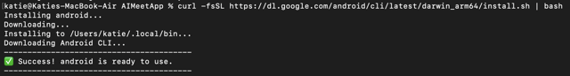

### Add the App Functions Skill

Now that you have the CLI, let's "teach" Gemini how to handle App Functions by adding the skill.

Run this command in your terminal:
```bash
android skills add appfunctions
```

This downloads the metadata and instructions that Gemini needs to understand how to write and optimise App Functions for you and will add it to the directory for all AIs that you have installed.

If you don't have any existing agent directories and don't specify particular agents, the skills will be installed for Gemini and Antigravity at `~/.gemini/antigravity/skills`.

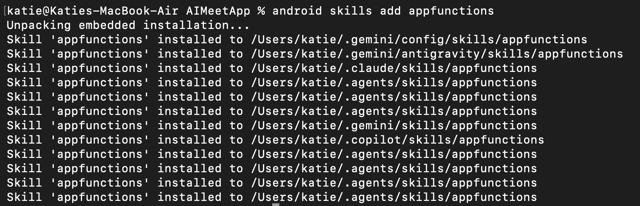
*As you can see, I am trying out all of the agents!*

There are a whole bunch of Android Skills available for use, you can check them out [here](https://developer.android.com/tools/agents/android-skills).

### Set up Gemini in Android Studio

If you haven't used Gemini in Android Studio yet, follow these steps to get started on the **Free Tier** (no AI credits or credit card required):

1.  **Sign In:** Click the **Profile icon** (top right of Android Studio) and sign in with your Google account.
2.  **Open Gemini:** Go to **View > Tool Windows > Gemini**. Or press on the Agent icon on the right.
3.  **Onboard:** Accept the terms of service. When prompted for a plan, the **Free Tier (Gemini Flash)** is perfectly sufficient for this codelab.

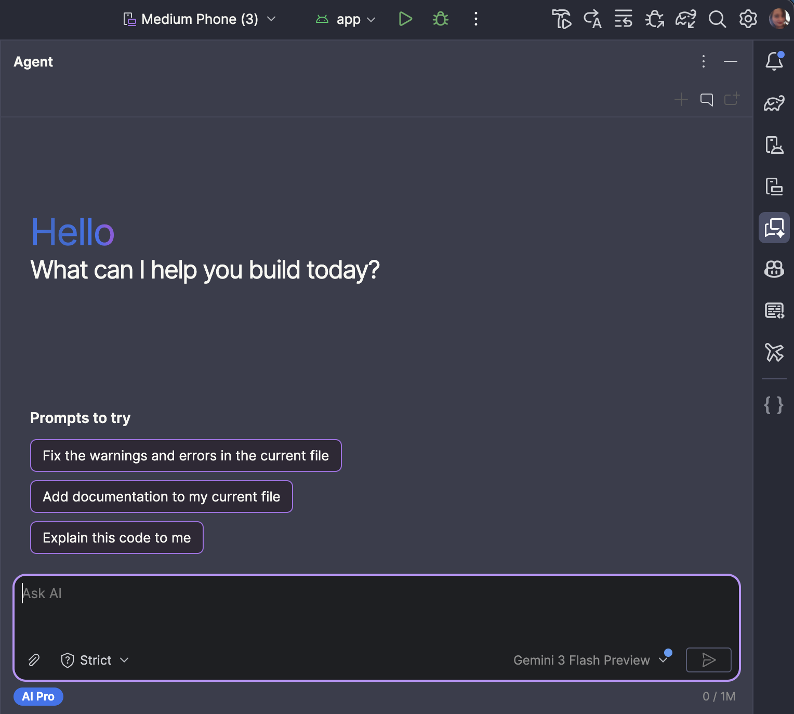

### Prompt Gemini to create a new App Function: `addPlay`

Now let's put the skill to work. We'll ask Gemini to implement the `addPlay` function for us.

In the Gemini chat box, enter the following prompt:

> I need to add a new function to `GameAppFunctions.kt` called `addPlay`. Use the **App Functions skill** to implement it.
> 
> The function should:
> 1. Take `gameId` (Long), `numPlayers` (Int), `playTimeMinutes` (Int), and `rating` (Float).
> 2. Use `gameRepository.getGameById(gameId)` to check if the game exists.
> 3. Create a `PlayEntity` and save it using `gameRepository.insertPlay(play)`.
> 4. Return a `PlayRecord` summary.
> 5. Include the `@AppFunction` annotation and full KDocs."

I have deliberatly made

### Review and Apply

Gemini will generate the code block.

1.  Review the generated code in the Gemini window. It should use the `gameRepository`.
2.  Click the **Apply to Files** button (the icon that looks like a document with a checkmark) to automatically insert the code into `GameAppFunctions.kt`.
3.  If any imports are missing (appearing in red), click on them and press `Alt+Enter` (Windows) or `Option+Enter` (Mac) to add them.

> **Important:** Ensure Gemini also generates or updates the `PlayRecord` data class at the bottom of the file. It must be annotated with `@AppFunctionSerializable(isDescribedByKDoc = true)` for the AI agent to understand the output (just like we had with `GameSummary`!

Your `addPlay` function should now be ready to use, of course, because this is AI, it may look a bit different to the sample code, but should hopefully function the same. 

In the next step, we'll build the app and test it with a real AI agent!

## Testing Your App Functions
Duration: 2

Now that we have some App Functions for Game Night Guru, it’s time to see them in action. We are going to test the plumbing to make sure the Android system sees our functions using ADB from the command line, and then use a testing agent to watch Gemini interact with our app.

Make sure you have created an emulator (see step **Create an Android Emulator**) or connect a physical Android device via a cable and installed Game Night Guru onto the device. 

### Enable Developer Options
Before we can use ADB, we need to enable USB debugging (both for emulators and physical devices). To do this, we need to enable Developer Options. 

1. Open your device **Settings**.
2. Scroll down and tap **About phone**. 
   *(Note: On Samsung devices, you will then need to tap **Software information**).*
3. Find the **Build number** and tap it **7 times** quickly.
4. You will see a small message saying "You are now a developer!".
5. Go back to the main Settings menu, and you will now see **Developer options** listed at the bottom.

[](https://youtu.be/_tUGcSy3uBk)

If you can't see the `Build Number` option, check [here](https://developer.android.com/studio/debug/dev-options#enable) for exact menu path for most manufacturers.

## Install ADB (Android Debug Bridge)
Duration: 2

[ADB](https://developer.android.com/tools/adb) is the command-line tool that lets your computer talk to your Android device or emulator. Because we are using Android Studio for this codelab, you likely already have it installed! We just need to make sure you can run it from your terminal.

> {.special} You can either use any terminal application on your device, or you can use the terminal within Android Studio. If you can't find it, you can open it via **Tools > Tool Windows > Terminal**

To check that you have it installed, open your terminal and run:

```bash
adb
```

You should see the version and install location:

```bash 
you@YourComputer GameNightGuru % adb
Android Debug Bridge version 1.0.41
Version 36.0.0-13206524
Installed as /opt/homebrew/bin/adb
Running on Darwin 25.5.0 (arm64)
```

If you don't see this, you can follow these install instructions:

**Using Android Studio**

Go to **Tools > SDK Manager > SDK Tools** and check **Android SDK Platform-Tools** and press `OK`

**For Mac Users:**

The easiest way is using Homebrew. Open your terminal and run:

```bash
brew install android-platform-tools
```

**For Windows Users:**

The fastest way is using Winget. Open PowerShell or Command Prompt and run:


```bash
winget install Google.PlatformTools
```

_(Alternatively, download the [SDK Platform-Tools zip file](https://developer.android.com/tools/releases/platform-tools), extract it, and [add the folder to your Windows system Environment Variables](https://www.youtube.com/watch?v=UVlNBv3Yhv8))._

**Verify it works:**

Try `adb` now!

### Check your devices are connected

Plug in your device or start your emulator and run:

```bash
adb devices
```

If you see a device listed, you are ready to go!


> **Warning:** If you have two devices listed, then you will run into some issues later where you have to specify which device to run the commands on. I recommend disconnecting one so you only have one device listed - it is much easier!

## Test App Functions Integration via ADB
Duration: 2

Before we bring AI into the mix, let’s verify that the Android OS has successfully registered the App Functions we just built.

Run this command in your terminal to list all App Functions currently registered on your device:

```bash
adb shell cmd app_function list-app-functions
```

Because that list can get long, you can filter it specifically for Game Night Guru using `grep`:

```bash
adb shell cmd app_function list-app-functions | grep -A 20 dev.katiebarnett.gamenightguru
```

> **Note:** Make sure to replace the package name if you have updated it to your own name

If you see the functions we wrote (like `queryGames`), everything is working and Game Night Guru is exposing its capabilities to the OS!
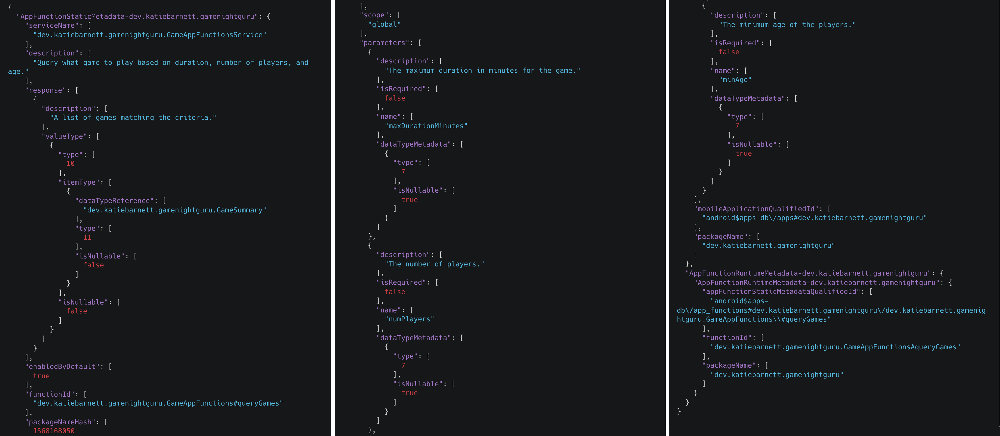

### Something fun to explore

If you don't include the grep command (delete the  `| grep -A 20 dev.katiebarnett.gamenightguru` part) , what other app functions do you see on this device? Perhaps try it when you have your actual phone connected. Are any of your favourite apps already using App Functions?

## Download & Install the Testing Agent
Duration: 5

Google provides a privileged Testing Agent app that acts as a stand-in for Gemini. This allows us to test end-to-end workflows without needing a full production system.

1. To use the testing agent, you need to enable Developer Options on your emulator or device

2. To get the Testing Agent app you can do one of the following:

[Download Source Code](https://github.com/android/appfunctions/archive/refs/heads/main.zip)

- Clone the the official App Functions repository using your terminal:
  ```bash
  git clone https://github.com/android/appfunctions.git
  ```
- Clone the official App Functions repository using your favourite source control application using:
  ```bash
  git@github.com:android/appfunctions.git
  ```

3. Open your terminal (or use the Android Studio Terminal) and change to the agent directory:
```bash
cd appfunctions/agent
```
    
4. Build and install the agent to your connected device using the provided script:
```bash
./run_privileged.sh --build
```

**⚠️ Important Note for Windows Users:**

Because this is a `.sh` shell script, it will not run in standard Command Prompt or PowerShell. You must run this command using **Git Bash** (which is installed automatically if you have Git for Windows) or WSL (Windows Subsystem for Linux).

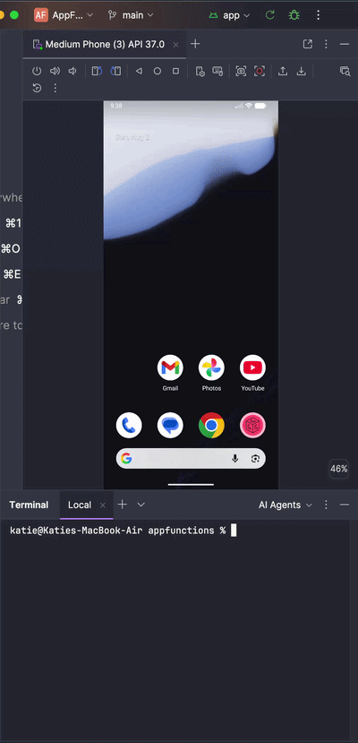

## Using the Testing Agent 
Duration: 2

The first thing we can do is check that the agent sees the App Functions. Using the dropdown, check which apps have app functions. You can enter parameters and get back the exact results the function returns (no AI involvement yet) and execute functions that update the data.

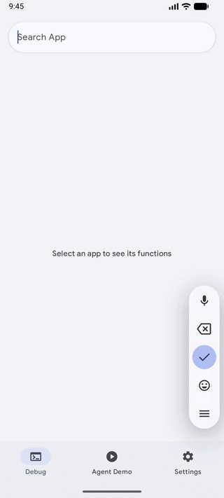

Now we know it can see our app and the available App Functions, let's hook it up to Gemini!

## Get a Gemini API Key to Test with Gemini
Duration: 2

To give our Testing Agent a brain, we need a Gemini API key. We will be using the free tier so no need to add a credit card or sign up to a pro plan.

1. Go to [Google AI Studio](https://aistudio.google.com/).
2. Sign in with your Google account.
3. Click the **Get API key** button in the left-hand menu.
 
 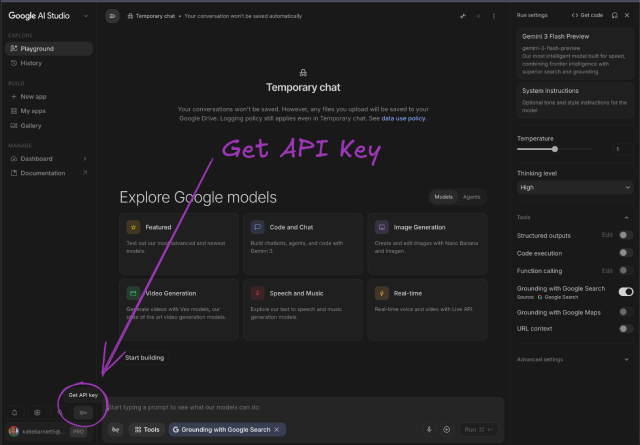
 
4. Click **Create API key**

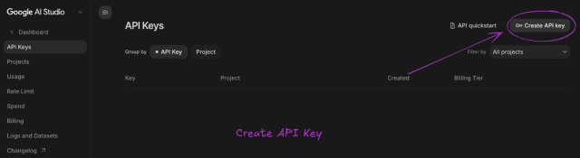

5. Click **Create project** in the **Choose an imported project** dropdown

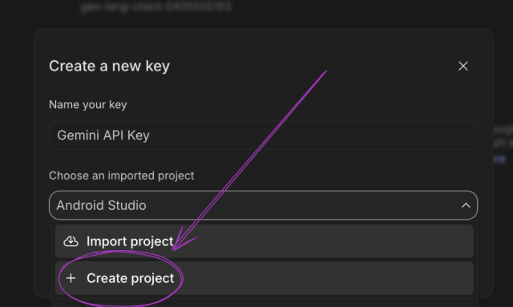

6. Enter the project name and click **Create project**

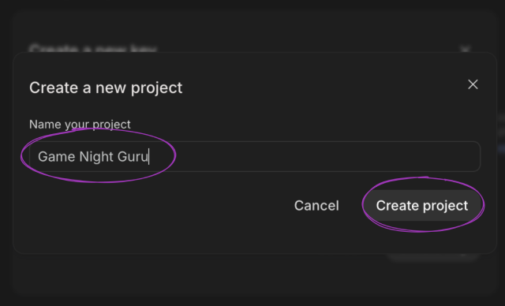

7. Click **Create key**

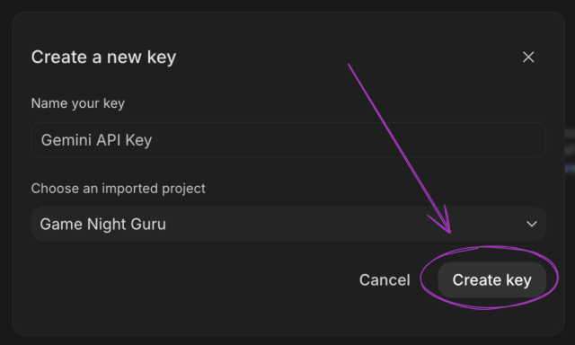

8. Copy the generated key using the copy icon or the **Copy key** button

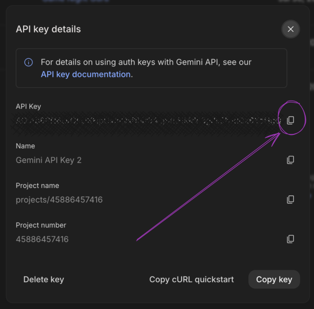  

9. If you missed copying it, you can now find it in the list of keys in [AI Studio](https://aistudio.google.com/app/apikey)

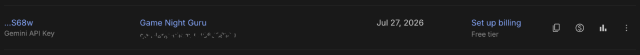

## Test it Live!
Duration: 5

This is where the magic happens. We are going to ask the agent a natural language question and watch it trigger our app's specific function.

1. Open the **AppFunctions Testing Agent** app on your Android device/emulator.
    
2. Navigate to the **Settings** screen. Paste your Gemini API key (copied from the previous step) into the settings/configuration screen of the agent.

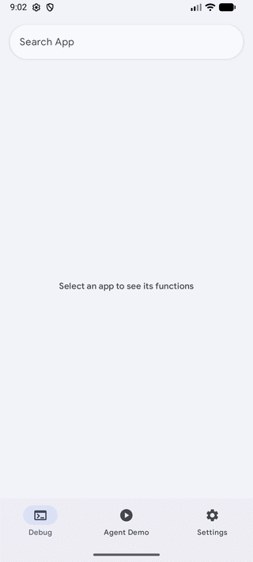
    
3. Navigate to the **Agent Demo**, type a natural language prompt that targets the function we wrote. For example:
    
     _"I have 4 friends coming over for 2 hours and we love strategy games. What should we play?"_
        
3. Press **send**.
    
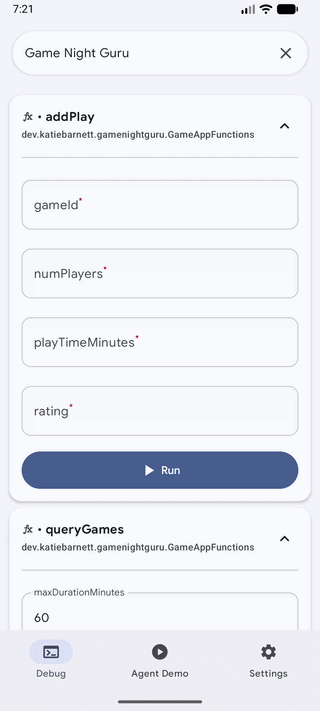
*Some sequences may be shortened!*

You will see the agent process the prompt (note - it may take a bit longer than my video!), discover our `queryGames` App Function, map "4 friends" and "2 hours" to our function's parameters, and instantly surface the correct game from our database!

If we think back to our KDoc prompt:

```kotlin
/**  
 * Query what game to play based on duration, number of players, and age. 
 *  
 * @param maxDurationMinutes The maximum duration in minutes for the game.  
 * @param numPlayers The number of players.  
 * @param minAge The minimum age of the players.  
 * @return A list of games matching the criteria.  
 */
```

We did not ask for the agent to go grab any extra information, but it did include the description about the games from the internet to make it more engaging!

### Something for you to try
Now ask Gemini to add a play then go and check to see if it has worked in the app.

## Wrapping Up
Duration: 1

This perfectly highlights the magic of agentic AI. Our app did the heavy lifting of querying the local database for the exact constraints. But Gemini took over the presentation layer. It seamlessly combined our app's strictly structured local data with its own vast world knowledge to create a conversational, engaging response for the user, entirely for free. 

Think about what this means for us as developers! In a traditional app, if we wanted to show a dynamic summary or thematic description of the game, we’d have to build another API call, design a new UI layout, and wire it all up to tie it all together. With App Functions, we just hand the raw data back to the agent, and it handles the formatting and contextual enrichment automatically. We get to focus on our app's core logic, and the AI handles the rest.

It does show exactly why your KDocs are so critical. We didn't explicitly tell the agent to go search the web for descriptions, but because our `@AppFunction` parameters and return types were clearly documented—and we set `isDescribedByKDoc = true`—the LLM understood exactly what kind of entity it was holding. It then intuitively knew that adding a thematic description would best answer the user's implicit intent. The better your comments, the smarter the agent behaves!

While the App Functions API is still in private preview, there is absolutely nothing stopping you from preparing your app right now. By annotating your key features today, testing them locally with ADB, and refining those KDocs, you'll be lightyears ahead when the API opens up to the public. If you're looking for a shortcut, try the dedicated AppFunctions agent skill in the Android skills repository to automatically generate the required Kotlin code and metadata configurations. Take a look at your app's core workflows, pick one that users would love to trigger using natural language or even with their voice, and give it a try!

**Start building, get those functions ready, and introduce your codebase to Gemini. AI, meet App!**